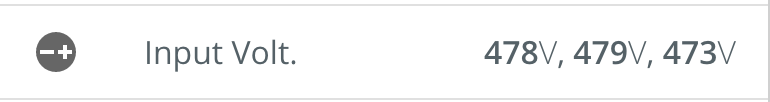

# Channel Value
The ChannelValue component is used to display a channel value (and units). This component abstracts the styles used to display the channel and units as well as an optional inline icon. These are used as part of the [Hero](./Hero.md) component, but can also be used inline (e.g., in a list).

Icons are passed in as a child element of the ChannelValue component.




## Usage
```
// app.module.ts
import { ChannelValueModule } from '@pxblue/angular-components/core/channel-value';
...
imports: [
    ChannelValueModule
  ],
```
```
// your-component.html
<pxb-channel-value class="content" value="65" units="%" [prefix]="true" fontSize="10px" >
  <mat-icon >trending_up</mat-icon>
</pxb-channel-value>
```

## API
| Prop Name   | Description                                    | Type                     | Required | Default   | Examples           |
|-------------|------------------------------------------------|--------------------------|----------|-----------|--------------------|
| value       | The the value (bold text) to display           | `string` &vert; `Number` | yes      |           | '125'              |
| units       | The text to display for the units (light text) | `string`                 | no       |           | 'Hz'               |
| prefix      | Show units before the value                    | `boolean`                | no       | false     |                    |
| fontSize    | The size of the font                           | `string`                 | no       | 'inherit' | '12rem'            |
| color       | The color of the font                          | `string`                 | no       | 'inherit' | 'rgba(0,0,0,0.25)' |

