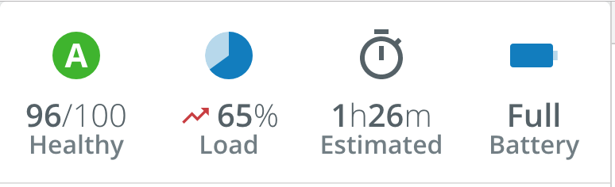

# Hero Components
The PX Blue Hero components are used to call attention to particular values that are of the most importance to the user. These are typically displayed in a banner.


## Hero
The Hero component displays a particular icon, value/units, and a label. Icon components are passed as a child element with the ```primary``` attribute - these will typically be a Material icon, PX Blue icon, or Progress Icon. It will also accept Text/Emoji values inside of a ```<span>``` element.

The value section of the Hero utilizes a [ChannelValue](./ChannelValue.md) component. To display a single simple value, the information can be passed as attributes (```value```, ```units```). An icon can be passed as a child of the ```pxb-hero``` component with the ```secondary``` attribute. For more complex values (such as a duration that displays hours and minutes), you can pass in multiple ```<pxb-channel-value>``` components as children and they will be displayed inline.

### Hero Usage
```
// app.module.ts
import { HeroModule } from '@pxblue/angular-components';

...
imports: [
    HeroModule
  ],
```
```
// Simple usage via Hero attributes
<pxb-hero label="Healthy" value="96" units="/100">
  <mat-icon primary>timer</mat-icon>
  <mat-icon secondary>trending_up</mat-icon>
</pxb-hero>

// Complex example with multiple values as children
<pxb-hero label="Load">
  <mat-icon primary>timer</mat-icon>
  <pxb-channel-value value="1" units="h"></pxb-channel-value>
  <pxb-channel-value value="26" units="m"></pxb-channel-value>
</pxb-hero>
```

### Available properties
* ```label``` (String)[**required**]: text to display below the value. 
* ```iconSize``` (String): the size of the icon. ***Default***: "normal" (36).
* ```fontSize``` ("normal", "small"): the font size to use for the ```ChannelValue```. **Default**: "normal".
* ```value``` (Number, String): when displaying a single ```ChannelValue```, the value.
* ```units``` (String): when displaying a single ```ChannelValue```, the units.


### Hero API
| Prop Name           | Description                             | Type                                                               | Required | Default                | Examples                       |
|---------------------|-----------------------------------------|--------------------------------------------------------------------|----------|------------------------|--------------------------------|
| label               | The text shown below the `ChannelValue` | `string`                                                           | yes      |                        | 'Status'                       |
| iconSize            | The size of the primary icon (10-48)    | `string`                                                           | no       | 'normal' (36)          | 'large'                        |
| fontSize            | The text size for the value line        | 'normal' &vert; 'small'                                            | no       | 'normal'               |                                |
| value               | The value for the channel               | `string` &vert; `number`                                           | no       |                        | 240, 'Off'                     |
| units               | Text to show after the value            | `string`                                                           | no       |                        | 'Hz', '$'                      |


> **Note**: When using the ```iconSize``` attribute, you may specify either normal (36px) or large (72px). When using ```<mat-icon>``` icons (not PX Blue supplemental icon), you may also specify a numeric value from 10 to 72.


## Hero Banner
The HeroBanner component is a simple wrapper component that is used to contain ```<pxb-hero> </pxb-hero>```s. It creates the flex container and sets up the spacing rules to display them. It accepts up to four ```<pxb-hero> </pxb-hero>``` components as its children.

### Hero Banner Usage

```
// app.module.ts
import { HeroModule } from '@pxblue/angular-components/core/hero';
...
imports: [
    HeroModule
],
```
```
// your-component.html
 <pxb-hero-banner [divider]="true"></pxb-hero-banner>
```

### Hero Banner API
| Prop Name | Description                             | Type      | Required | Default | Examples |
|-----------|-----------------------------------------|-----------|----------|---------|----------|
| divider   | Whether to show the line separator      | `boolean` | no       | false   |          |


