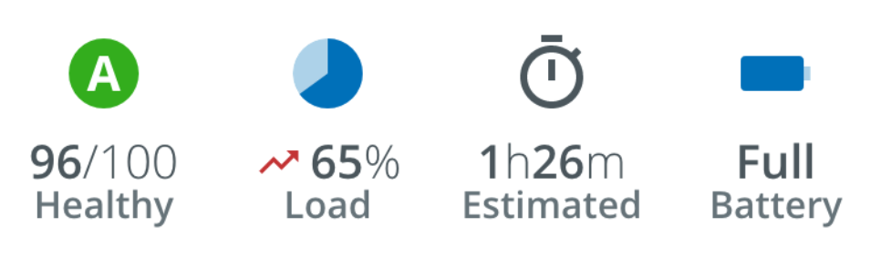

# Channel Value

The `<pxb-channel-value>` component is used to display a channel value (and units). This component abstracts the styles used to display the channel and units as well as an optional inline icon. These are used as part of the [`<pxb-hero>`](./Hero.md) component, but can also be used inline (e.g., in a list).

Icons are passed in as a child element of the `<pxb-channel-value>` component.

<div style="text-align:center; margin-bottom:20px">
    
    <hr/>
    
</div>

## Usage

<div style="width: 100%; text-align: center">
    
</div>

```typescript
// app.module.ts
import { ChannelValueModule } from '@pxblue/angular-components';
...
imports: [
    ChannelValueModule
],
```

```html
// your-component.html
<pxb-channel-value class="content" value="65" units="%" [prefix]="true">
    <mat-icon>trending_up</mat-icon>
</pxb-channel-value>
```

## API

Parent element (`<pxb-channel-value>`) attributes:

<div style="overflow: auto;">

| @Input | Description                                    | Type                 | Required | Default |
| ------ | ---------------------------------------------- | -------------------- | -------- | ------- |
| prefix | Show units before the value                    | `boolean`            | no       | false   |
| units  | The text to display for the units (light text) | `string`             | no       |         |
| value  | The the value (bold text) to display           | `string` \| `number` | yes      |         |

</div>

The following child element is projected into `<pxb-channel-value>`:

| Selector | Description             | Required | Default |
| -------- | ----------------------- | -------- | ------- |
| (child)  | Icons shown on the left | no       |         |

### Classes

Each PX Blue component has classes which can be used to override component styles:

| Name                           | Description                          |
| ------------------------------ | ------------------------------------ |
| pxb-channel-value              | Styles applied to the root element   |
| pxb-channel-value-icon-wrapper | Styles applied to the icon container |
| pxb-channel-value-units        | Styles applied to the units @Input   |
| pxb-channel-value-value        | Styles applied to the value @Input   |
