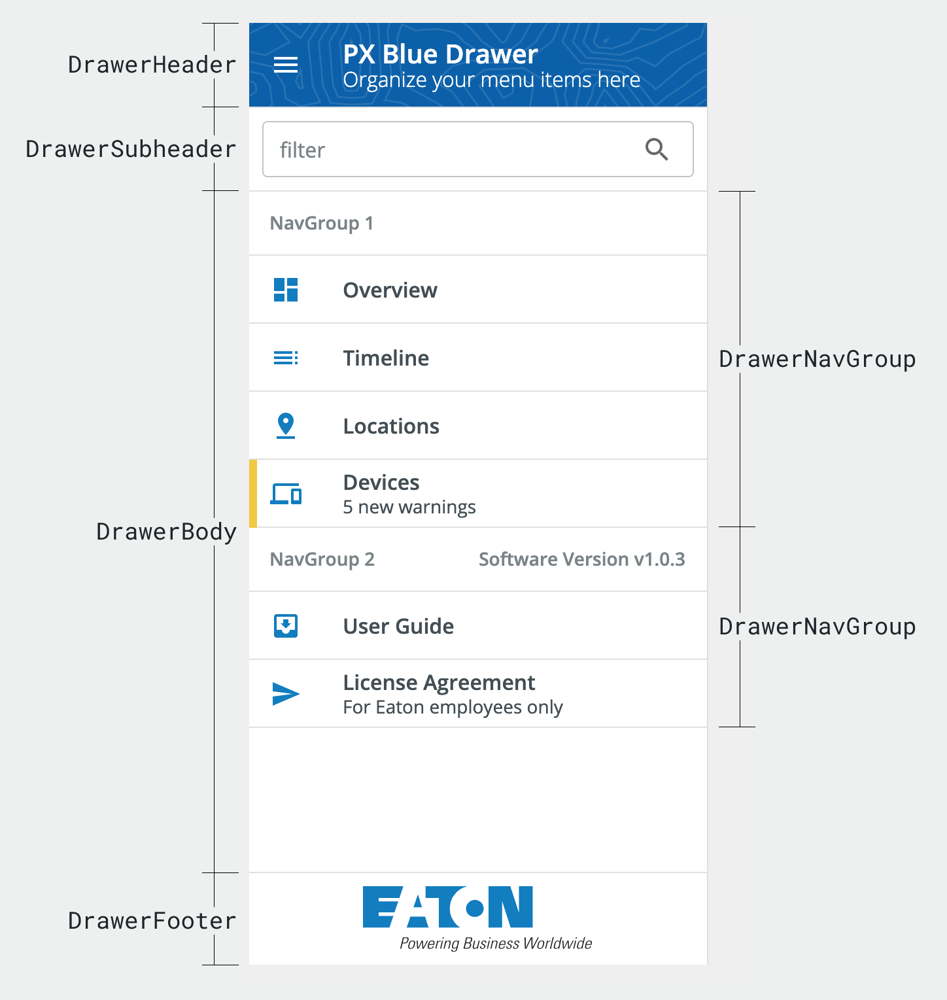

# Drawer

 The `<pxb-drawer>` is used to organize content (typically navigation links) within a `<pxb-drawer-layout>`. The `<pxb-drawer>` includes helper components for `<pxb-drawer-header>`, `<pxb-drawer-subheader>`, `<pxb-drawer-body>`, `<pxb-drawer-nav-group>`, `<pxb-drawer-footer>`, and `<pxb-drawer-layout>` to help organize the content.


<div style="width: 100%; text-align: center">
    
</div>

### Drawer Usage

```html
<pxb-drawer [open]="state.open">
    <pxb-drawer-header>Header content goes here</pxb-drawer-header>
    <pxb-drawer-subheader>Subheader content goes here</pxb-drawer-subheader>
    <pxb-drawer-body>Body content goes here</pxb-drawer-body>
    <pxb-drawer-footer>Footer content goes here</pxb-drawer-footer>
</pxb-drawer>
```

### Drawer API

Parent element (`<pxb-drawer>`) attributes:

<div style="overflow: auto;">

| @Input               | Description                               | Type           | Required | Default   |
| -------------------- | ----------------------------------------- | -------------- | -------- | ----------|
| open                 | State for the drawer                      | `boolean`      | yes      |           |

</div>

The following child elements are projected into `<pxb-drawer>`:

<div style="overflow: auto;">

| Selector               | Description                             | Required | Default |
| ---------------------- | --------------------------------------- | -------- | ------- |
| [pxb-drawer-header]    | A component to render header content    | no       |         |
| [pxb-drawer-subheader] | A component to render subheader content | no       |         |
| [pxb-drawer-body]      | A component to render body content      | no       |         |
| [pxb-drawer-footer]    | A component to render footer content    | no       |         |

</div>

### Drawer Classes

Each PX Blue component has classes which can be used to override component styles: 

<div style="overflow: auto;">

| Name                                 | Description                                   |
|--------------------------------------|-----------------------------------------------|
| pxb-drawer                           | Styles applied to the root element            |
| pxb-drawer-hover-area                | Hoverable area that temporarily opens drawer  |

</div>

## Drawer Layout

The `<pxb-drawer-layout>` component is a wrapper around the [Angular Material Sidenav](https://material.angular.io/components/sidenav/overview) that adds specific PX Blue functionality and styling. The `<pxb-drawer-layout>` component is used to provide the appropriate resizing behavior for your main application content when used in conjunction with a PX Blue `<pxb-drawer>`. It accepts a drawer and content as child elements;

### Drawer Layout Usage

```html
<pxb-drawer-layout>
    <pxb-drawer drawer>Drawer goes here</pxb-drawer>
    <div content>Content goes here</div>
</pxb-drawer-layout>
```

### Drawer Layout API

Parent element (`<pxb-drawer-layout>`) attributes:

<div style="overflow: auto;">

| @Input     | Description                          | Type                                       | Required | Default     |
| ---------- | ------------------------------------ | ------------------------------------------ | -------- | ----------- |
| variant    | Sets the drawer variant              | `'permanent' | 'persistent' | 'temporary'` | yes      |             |
| width      | Drawer pixel width                   | `number`                                   | no       | 350         |


</div>

<div style="overflow: auto;">

| @Output       | Description                                          | Type                |
| ------------- | ---------------------------------------------------- | ------------------- |
| backdropClick | Event triggered on `tempory` variant backdrop click | `EventEmitter<void>` | 

</div>

The following child elements are projected into `<pxb-drawer-layout>`:

<div style="overflow: auto;">

| Selector       | Description                          | Required | Default |
| -------------- | ------------------------------------ | -------- | ------- |
| [drawer]       | A component to render a drawer       | no       |         |
| [content]      | A component to render content        | no       |         |

</div>

### Drawer Layout Classes

Each PX Blue component has classes which can be used to override component styles: 

<div style="overflow: auto;">

| Name                                        | Description                                   |
|---------------------------------------------|-----------------------------------------------|
| pxb-drawer-layout                           | Styles applied to the root element            |
| pxb-drawer-layout-sidenav                   | Styles applied to mat-sidenav-container       |
| pxb-drawer-layout-nav-content               | Styles applied to mat-sidenav-content         |

</div>

## Drawer Header

The `<pxb-drawer-header>` contains the content found at the top of the `<pxb-drawer>`. 

### Drawer Header Usage

```html
<pxb-drawer-header title="PX Blue Drawer">
     <button pxb-icon mat-icon-button>
       <mat-icon>menu</mat-icon>
     </button>
</pxb-drawer-header>
```

### Drawer Header API

Parent element (`<pxb-drawer-header>`) attributes:

<div style="overflow: auto;">

| @Input   | Description                         | Type     | Required | Default |
| -------- | ----------------------------------- | -------- | -------- | ------- |
| subtitle | The text to show on the second line | `string` | no       |         |
| title    | The text to show on the first line  | `string` | no       |         |

</div>

The following child elements are projected into `<pxb-drawer-header>`:

<div style="overflow: auto;">

| Selector       | Description                          | Required | Default |
| -------------- | ------------------------------------ | -------- | ------- |
| [pxb-icon]     | A component to render an icon        | no       |         |
| [titleContent] | Custom content for header title area | no       |         |

</div>

### Drawer Header Classes

Each PX Blue component has classes which can be used to override component styles: 

<div style="overflow: auto;">

| Name                                        | Description                                   |
|---------------------------------------------|-----------------------------------------------|
| pxb-drawer-header                           | Styles applied to the root element            |
| pxb-drawer-header-background                | Styles applied to the header background       |
| pxb-drawer-header-icon-wrapper              | Styles applied to the header icon             |
| pxb-drawer-header-title-wrapper             | Styles applied to title/subtitle wrapper      |
| pxb-drawer-header-title                     | Styles applied to the title                   |
| pxb-drawer-header-subtitle                  | Styles applied to the subtitle                |
| pxb-drawer-header-title-content-wrapper     | Styles applied to custom titleContent         |

</div>

## Drawer Subheader

The `<pxb-drawer-subheader>` is an optional section that renders below the header and above the body of the `<pxb-drawer>`. It can be used to support custom content (passed as children), such as filtering options or to display additional information.

### Drawer Subheader Usage

```html
<pxb-drawer-subheader>
    <div>Custom Subheader Content goes here</div>
</pxb-drawer-subheader>
```

### Drawer Subheader API 

Parent element (`<pxb-drawer-subheader>`) attributes:

<div style="overflow: auto;">

| @Input   | Description                         | Type      | Required | Default |
| -------- | ----------------------------------- | --------- | -------- | ------- |
| divider  | Show a divider below subheader      | `boolean` | no       |  true   |

</div>


### Drawer Subheader Classes

Each PX Blue component has classes which can be used to override component styles: 

<div style="overflow: auto;">

| Name                                        | Description                                       |
|---------------------------------------------|---------------------------------------------------|
| pxb-drawer-subheader                        | Styles applied to the root element                |
| pxb-drawer-subheader-closed                 | Styles applied to subheader when drawer is closed |

</div>

## Drawer Body

The `<pxb-drawer-body>` is a wrapper for the main content of the Drawer. The typical use case is to display `<pxb-drawer-nav-group>` elements, but custom elements (e.g., for spacing) are accepted as well.

### Drawer Body Usage

```html
<pxb-drawer-body>
    <pxb-drawer-navgroup></pxb-drawer-navgroup>
</pxb-drawer-body>
```

### Drawer Body Classes

Each PX Blue component has classes which can be used to override component styles: 

<div style="overflow: auto;">

| Name                                        | Description                                   |
|---------------------------------------------|-----------------------------------------------|
| pxb-drawer-body                             | Styles applied to the root element            |

</div>

## Drawer NavGroup
A `<pxb-drawer-nav-group>` is used inside of the `<pxb-drawer-body>` to organize links and content. Each group consists of an (optional) group title and a series of NavItems.

### Drawer NavGroup Usage

```html
<pxb-drawer-nav-group title="Group Name">
    <pxb-drawer-nav-item></pxb-drawer-nav-item>
</pxb-drawer-nav-group>
```

### Drawer NavGroup API 

Parent element (`<pxb-drawer-nav-group>`) attributes:

<div style="overflow: auto;">

| @input     | Description                             | Type      | Required | Default |
| ---------- | --------------------------------------- | --------- | -------- | ------- |
| divider    | Divider that appears under the title    | `boolean` | no       | false   |
| title      | Component to render a group title       | `string`  | no       |         |

</div>

The following child element is projected into `<pxb-drawer-nav-group>`:

<div style="overflow: auto;">

| Selector              | Description                               | Required | Default |
| --------------------- | ----------------------------------------- | -------- | ------- |
| [pxb-drawer-nav-item] | Navigation elements to render             | no       |         |
| [titleContent]        | Custom title element to render            | no       |         |

</div>

### Drawer NavGroup Classes

Each PX Blue component has classes which can be used to override component styles: 

<div style="overflow: auto;">

| Name                                        | Description                                   |
|---------------------------------------------|-----------------------------------------------|
| pxb-drawer-nav-group                        | Styles applied to the root element            |
| pxb-drawer-nav-group-title                  | Styles applied to the nav group title         |

</div>

## Drawer Nav Item
The `<pxb-drawer-nav-item>` is a wrapper to the `<pxb-info-list-item>` that is meant to be used within a `<pxb-nav-group>`. 

### Drawer NavItem API 

Parent element (`<pxb-drawer-nav-item>`) attributes:

<div style="overflow: auto;">

| @input                   | Description                                | Type                 | Required | Default |
| ------------------------ | ------------------------------------------ | -------------------- | -------- | ------- |
| activeItemBackgroundShape| Sets the active item background shape      | `'round' | 'square'` | no       | 'round' |
| chevron                  | Sets whether to show chevron               | `boolean`            | no       | false   |
| divider                  | Sets whether to show divider               | `boolean`            | no       | true    |
| hidePadding              | Sets whether to show/hide padding          | `boolean`            | no       |         |
| ripple                   | Sets whether to show/hide ripple           | `boolean`            | no       | true    |
| selected                 | Sets whether an item is selected           | `boolean`            | no       |         |
| statusColor              | Status stripe color                        | `string`             | no       |         |
| subtitle                 | Text to display as a subtitle              | `string`             | no       |         |
| title                    | Text to display as a title                 | `string`             | no       |         |

</div>

<div style="overflow: auto;">

| @Output       | Description                                          | Type                 |
| ------------- | ---------------------------------------------------- | -------------------- |
| select       | Event triggered on nav item select                    | `EventEmitter<void>` | 

</div>

The following child element is projected into `<pxb-drawer-nav-item>`:

<div style="overflow: auto;">

| Selector              | Description                                  | Required | Default |
| --------------------- | -------------------------------------------- | -------- | ------- |
| [icon]                | Custom content to render an icon             | no       |         |
| [pxb-drawer-nav-item] | Custom content to render nested drawer items | no       |         |

</div>

### Drawer NavItem Classes

Each PX Blue component has classes which can be used to override component styles: 

<div style="overflow: auto;">

| Name                                        | Description                                   |
|---------------------------------------------|-----------------------------------------------|
| pxb-drawer-nav-item                         | Styles applied to the root element            |
| pxb-info-list-item-active:after             | Styles applied to 'selected' nav item         | 
| pxb-info-list-item-active.round             | Styles applied to round 'selected' nav item   |
| pxb-info-list-item-active.square            | Styles applied to square 'selected' nav item  |
| pxb-drawer-nav-item-expand-icon             | Styles applied to expand icon                 |
| pxb-drawer-nested-nav-item                  | Styles applied to nested nav items            |
| pxb-drawer-nav-item-depth-1                 | Styles applied to top-level nav items         | 
| pxb-drawer-nav-item-depth-2                 | Styles applied to nested nav items            | 
| pxb-drawer-nav-item-depth-3                 | Styles applied to nav items 3 levels deep     | 

</div>

## Drawer Footer

The `<pxb-drawer-footer>` is an optional section that renders at the bottom of the `<pxb-drawer>`. It can be used to add any custom content (as children).

### Usage

```html
<pxb-drawer-footer>
    <div>Custom Footer goes here</div>
</pxb-drawer-footer>
```

### Drawer Footer API 

Parent element (`<pxb-drawer-footer>`) attributes:

<div style="overflow: auto;">

| @Input   | Description                         | Type      | Required | Default |
| -------- | ----------------------------------- | --------- | -------- | ------- |
| divider  | Show a divider above footer         | `boolean` | no       |  true   |

</div>

### Drawer Footer Classes

Each PX Blue component has classes which can be used to override component styles: 

<div style="overflow: auto;">

| Name                                        | Description                                    |
|---------------------------------------------|------------------------------------------------|
| pxb-drawer-footer                           | Styles applied to the root element             |
| pxb-drawer-footer-closed                    | Styles applied to footer when drawer is closed |

</div>
