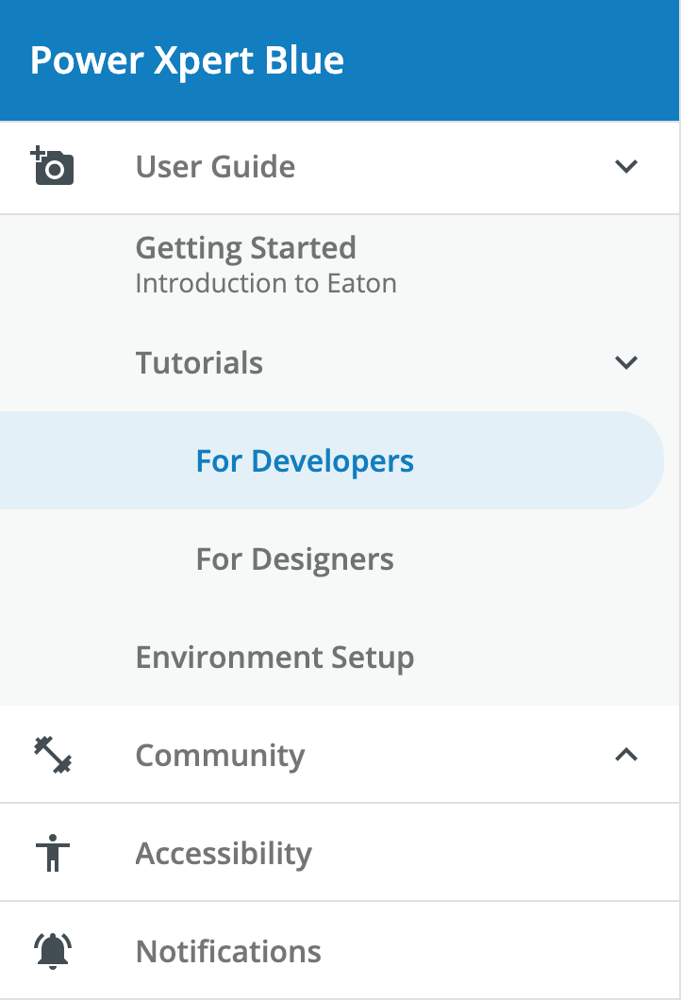

# Drawer

The `<pxb-drawer>` component is a wrapper around the [Angular Material Sidenav](https://material.angular.io/components/sidenav/overview) that adds specific PX Blue functionality and styling. It is used to organize content (typically navigation links) in a collapsible side panel. The `<pxb-drawer>` includes helper components for `<pxb-drawer-header>`, `<pxb-drawer-subheader>`, `<pxb-drawer-body>`, `<pxb-drawer-nav-group>`, `<pxb-drawer-footer>`, and `<pxb-drawer-layout>` to help organize the content.

<div style="width: 100%; text-align: center">
    
</div>

## Drawer Header

The `<pxb-drawer-header>` contains the content at the top of the `<pxb-drawer>`. By default, it renders multiple lines of text in the PX Blue style.

### Drawer Header API

Parent element (`<pxb-drawer-header>`) attributes:

<div style="overflow: auto;">

| @Input   | Description                         | Type     | Required | Default |
| -------- | ----------------------------------- | -------- | -------- | ------- |
| subtitle | The text to show on the second line | `string` | no       |         |
| title    | The text to show on the first line  | `string` | no       |         |

</div>

The following child elements are projected into `<pxb-drawer-header>`:

<div style="overflow: auto;">

| Selector       | Description                          | Required | Default |
| -------------- | ------------------------------------ | -------- | ------- |
| [icon]         | A component to render an icon        | no       |         |
| [titleContent] | Custom content for header title area | no       |         |

</div>

## Drawer Subheader

The `<pxb-drawer-subheader>` is an optional section that renders below the header and above the body of the `<pxb-drawer>`. It can be used to support custom content (passed as children), such as filtering options or to display additional information.

### Drawer Subheader Usage

```html
<pxb-drawer-subheader>
    <div subheaderContent>Custom Subheader Content goes here</div>
</pxb-drawer-subheader>
```

Parent element (`<pxb-drawer-subheader>`) attributes:

<div style="overflow: auto;">

| @input     | Description                             | Type      | Required | Default |
| ---------- | --------------------------------------- | --------- | -------- | ------- |
| drawerOpen | Controls whether to show/hide component | `boolean` | yes      |         |

</div>

The following child element is projected into `<pxb-drawer-subheader>`:

<div style="overflow: auto;">

| Selector           | Description                  | Required | Default |
| ------------------ | ---------------------------- | -------- | ------- |
| [subheaderContent] | Custom content for subheader | no       |         |

</div>

## Drawer Footer

The `<pxb-drawer-footer>` is an optional section that renders at the bottom of the `<pxb-drawer-footer>`. It can be used to add any custom content (as children).

### Usage

```html
<pxb-drawer-footer>
    <div footerContent>Custom Footer goes here</div>
</pxb-drawer-footer>
```

Parent element (`<pxb-drawer-footer>`) attributes:

<div style="overflow: auto;">

| @input     | Description                             | Type      | Required | Default |
| ---------- | --------------------------------------- | --------- | -------- | ------- |
| drawerOpen | Controls whether to show/hide component | `boolean` | yes      |         |

</div>

The following child element is projected into `<pxb-drawer-footer>`:

<div style="overflow: auto;">

| Selector        | Description               | Required | Default |
| --------------- | ------------------------- | -------- | ------- |
| [footerContent] | Custom content for footer | no       |         |

</div>
