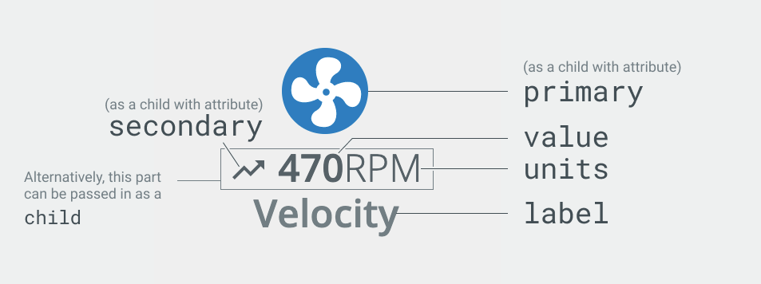

# Hero

The `<blui-hero>` components are used to call attention to particular values that are of the most importance to the user. These are typically displayed in a banner.

<div style="text-align:center">

</div>

The `<blui-hero>` component displays a particular icon, value/units, and a label. Icon components are passed as a child element with the `primary` attribute - these will typically be a Material icon, Brightlayer UI icon, or Progress Icon. It will also accept Text/Emoji values inside of a `<span>` element.

The value section of the `<blui-hero>` utilizes a [`<blui-channel-value>`](./ChannelValue.md) component. To display a single simple value, the information can be passed as attributes (`value`, `units`). An icon can be passed as a child of the `<blui-hero>` component with the `secondary` attribute. For more complex values (such as a duration that displays hours and minutes), you can pass in multiple `<blui-channel-value>` components as children and they will be displayed inline.

## Hero Usage

<div style="width: 100%; text-align: center">
    
</div>

```typescript
// app.module.ts
import { HeroModule } from '@brightlayer-ui/angular-components';

...
imports: [
    HeroModule
],
```

```html
// your-component.html 
// Simple usage via Hero attributes
<blui-hero label="Healthy" value="96" units="/100">
    <mat-icon blui-primary>timer</mat-icon>
    <mat-icon blui-secondary>trending_up</mat-icon>
</blui-hero>

// Complex example with multiple values as children
<blui-hero label="Load">
    <mat-icon blui-primary>timer</mat-icon>
    <blui-channel-value value="1" units="h"></blui-channel-value>
    <blui-channel-value value="26" units="m"></blui-channel-value>
</blui-hero>
```

## Hero API

Parent element (`<blui-hero>`) attributes:

<div style="overflow: auto;">

| @Input   | Description                            | Type                 | Required | Default       |
| -------- | -------------------------------------- | -------------------- | -------- | ------------- |
| iconSize | The size of the primary icon (10-48)   | `number`             | no       | 'normal' (36) |
| label    | The text shown below the Channel Value | `string`             | yes      |               |
| units    | Text to show after the value           | `string`             | no       |               |
| value    | The value for the channel              | `string` \| `number` | no       |               |

</div>

The following child elements are projected into `<blui-hero>`:

<div style="overflow: auto;">

| Selector         | Description                                                 | Required | Default |
| ---------------- | ----------------------------------------------------------- | -------- | ------- |
| (child)          | The `<blui-channel-value>` to display under the primary icon | no       |         |
| [blui-primary]   | The large icon displayed on the top                         | no       |         |
| [blui-secondary] | The icon displayed to the left of the value and units       | no       |         |

</div>

### Classes

Each Brightlayer UI component has classes which can be used to override component styles:

| Name                            | Description                                  |
| ------------------------------- | -------------------------------------------- |
| blui-hero                       | Styles applied to the tag                    |
| blui-hero-content               | Styles applied to the root element           |
| blui-hero-primary-wrapper       | Styles applied to the primary icon container |
| blui-hero-channel-value-wrapper | Styles applied to channel-value              |
| blui-hero-label                 | Styles applied to label @Input               |

# Hero Banner

The `<blui-hero-banner>` component is a simple wrapper component that is used to contain `<blui-hero>`s. It creates the flex container and sets up the spacing rules to display them. It accepts up to four `<blui-hero>` components as its children.

## Hero Banner Usage

```typescript
// app.module.ts
import { HeroModule } from '@brightlayer-ui/angular-components';
...
imports: [
    HeroModule
],
```

```html
<!-- your-component.html -->
<blui-hero-banner [divider]="true">
    <blui-hero [label]="'label'">
        <i blui-primary class="blui-grade_a"></i>
    </blui-hero>
</blui-hero-banner>
```

## Hero Banner API

Parent element (`<blui-hero-banner>`) attributes:

<div style="overflow: auto;">

| @Input  | Description                        | Type      | Required | Default |
| ------- | ---------------------------------- | --------- | -------- | ------- |
| divider | Whether to show the line separator | `boolean` | no       | false   |

</div>

The following child element is projected into `<blui-hero-banner>`:

<div style="overflow: auto;">

| Selector | Description           | Required | Default |
| -------- | --------------------- | -------- | ------- |
| (child)  | `blui-hero` to display | yes      |         |

### Classes

Each Brightlayer UI component has classes which can be used to override component styles:

| Name                     | Description                        |
| ------------------------ | ---------------------------------- |
| blui-hero-banner         | Styles applied to the root element |
| blui-hero-banner-divider | Styles applied to the divider      |
