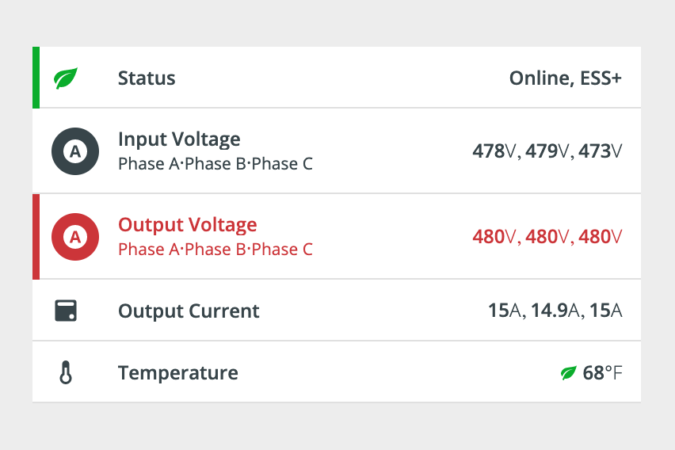

# Info List Item

The `<pxb-info-list-item>` is intended to be used in List views. It positions a title as well as optional subtitle(s), icon, and status stripe.



## Usage

```typescript
// app.module.ts
import { InfoListItemModule } from '@pxblue/angular-components';
...
imports: [
    InfoListItemModule
  ],
```

```html
// your-component.html
<pxb-info-list-item divider="full" [statusColor]="colors.green[500]">
    <div title>Info List Item</div>
    <mat-icon [style.color]="colors.green[500]" icon>eco</mat-icon>
</pxb-info-list-item>
```

## API

Parent element (`<pxb-info-list-item>`) attributes:

<div style="overflow: auto;">

| @input       | Description                            | Type                    | Required | Default |
| ------------ | -------------------------------------- | ----------------------- | -------- | ------- |
| avatar       | Show a colored background for the icon | `boolean`               | no       | false   |
| chevron      | Add a chevron icon on the right        | `boolean`               | no       | false   |
| dense        | Smaller height row with less padding   | `boolean`               | no       | false   |
| divider      | Show a row separator below the row     | `'full'` \| `'partial'` | no       |         |
| hidePadding  | Remove left padding if no icon is used | `boolean`               | no       | false   |
| statusColor  | Left border color                      | `string`                | no       |         |
| wrapSubtitle | Whether to wrap subtitle on overflow   | `boolean`               | no       | false   |
| wrapTitle    | Whether to wrap title on overflow      | `boolean`               | no       | false   |

</div>

The following child elements are projected into `<pxb-info-list-item>`:

<div style="overflow: auto;">

| Selector       | Description                         | Required | Default |
| -------------- | ----------------------------------- | -------- | ------- |
| [icon]         | A component to render for the icon  | no       |         |
| [leftContent]  | Content to render on the left side  | no       |         |
| [rightContent] | Content to render on the right side | no       |         |
| [subtitle]     | Content to render for the subtitle  | no       |         |
| [title]        | Content to render for the title     | yes      |         |

</div>

### Classes
Each PX Blue component has classes which can be used to override component styles: 

| Name                              | Description                                 |
|-----------------------------------|---------------------------------------------|
| pxb-info-list-item                          | Styles applied to the root element          |
| pxb-info-list-item-primary-wrapper          | Styles applied to the primary icon container|
| pxb-info-list-item-channel-value-wrapper    | Styles applied to channel-value             |
| pxb-info-list-item-label                    | Styles applied to label @Input              |
