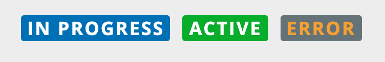

# List Item Tag

The `<blui-list-item-tag>` is a text item with a colored background and rounded corners that is used to tag lists.



## Usage

```typescript
// app.module.ts
import { ListItemTagModule } from '@brightlayer-ui/angular-components';
...
imports: [
    ListItemTagModule
  ],
...
```

```html
// your-component.html
<blui-list-item-tag label="Sample Label" backgroundColor="black" fontColor="gold"> </blui-list-item-tag>
```

## API

Parent element (`blui-list-item-tag`) attributes:

<div style="overflow: auto;">

| @Input          | Description                   | Type     | Required | Default |
| --------------- | ----------------------------- | -------- | -------- | ------- |
| backgroundColor | Color of the label background | `string` | no       |         |
| fontColor       | Color of the label            | `string` | no       |         |
| label           | The label text                | `string` | yes      |         |

</div>

### Classes

Each PX Blue component has classes which can be used to override component styles:

| Name                       | Description                        |
| -------------------------- | ---------------------------------- |
| blui-list-item-tag         | Styles applied to the tag          |
| blui-list-item-tag-content | Styles applied to the root element |
| blui-list-item-tag-label   | Styles applied to the label @Input |
