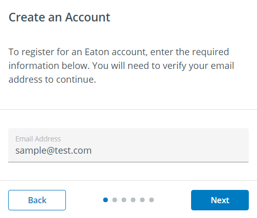

# Mobile Stepper

The `<blui-mobile-stepper>` is used to minimally display progress when completing a workflow that requires multiple steps. There are three types of progress indicators supported, `dots` (default), `text`, and `progress`.

<div style="text-align:center; margin-bottom:20px">
    
</div>

## Usage

```typescript
// app.module.ts
import { MobileStepperModule } from '@brightlayer-ui/angular-components';
...
imports: [
    MobileStepperModule
],
```

```ts
// your-component.ts
activeStep = 0;
steps = 4;
```

```html
// your-component.html
<blui-mobile-stepper [steps]="steps" [activeStep]="activeStep">
    <button
        blui-back-button
        mat-stroked-button
        color="primary"
        [disabled]="activeStep === 0"
        (click)="activeStep = activeStep - 1;"
    >
        Back
    </button>
    <button
        blui-next-button
        mat-flat-button
        color="primary"
        [disabled]="activeStep === steps - 1"
        (click)="activeStep = activeStep + 1;"
    >
        Next
    </button>
</blui-mobile-stepper>
```

## API

Parent element (`<blui-mobile-stepper>`) attributes:

<div style="overflow: auto;">

| @Input     | Description                        | Type                                   | Required                    | Default    | 
| ---------- | ---------------------------------- | -------------------------------------- | --------------------------- | ---------- | 
| activeStep | The index of the active step       | `number`                               | yes                         |            |  
| steps      | Total number of steps to display   | `number`                               | yes                         |            |              
| variant    | Which type of indicator to use     | `'dots'` \| `'progress'` \| `'text'`   | no                          | `'dots'`   |

</div>

The following child elements are projected into `<blui-mobile-stepper>`:

<div style="overflow: auto;">

| Selector          | Description         | Required | Default |
| ----------------- | ------------------- | -------- | ------- |
| [blui-back-button] | Stepper back button | no       |         |
| [blui-next-button] | Stepper next button | no       |         |

### Classes

Each PX Blue component has classes which can be used to override component styles:

| Name                                         | Description                                            |
| -------------------------------------------- | ------------------------------------------------------ |
| blui-mobile-stepper                          | Styles applied to the tag                              |
| blui-mobile-stepper-content                  | Styles applied to the mobile stepper container         |
| blui-mobile-stepper-dots                     | Styles applied to the mobile stepper dots container    |
| blui-mobile-stepper-dot                      | Styles applied to each dot in the stepper              |
| blui-mobile-stepper-dot-active               | Styles applied to the dot representing the active step |
| blui-mobile-stepper-dot-visited              | Styles applied to the visited dots                     |
| blui-mobile-stepper-dot-unvisited            | Styles applied to the dots that were not visited yet   |
| blui-mobile-stepper-next-button-wrapper      | Styles applied to the next button wrapper              | 
| blui-mobile-stepper-back-button-wrapper      | Styles applied to the back button wrapper              | 
