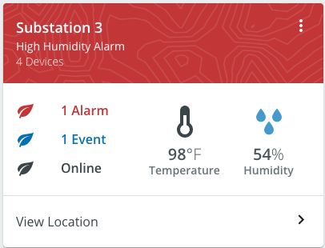
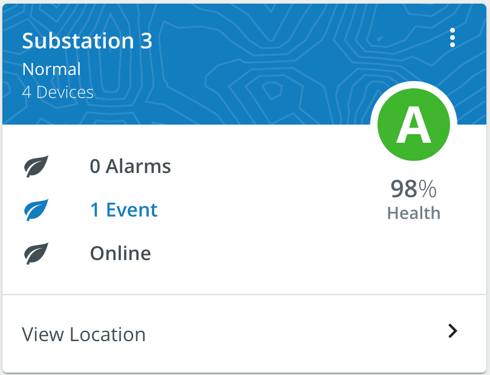
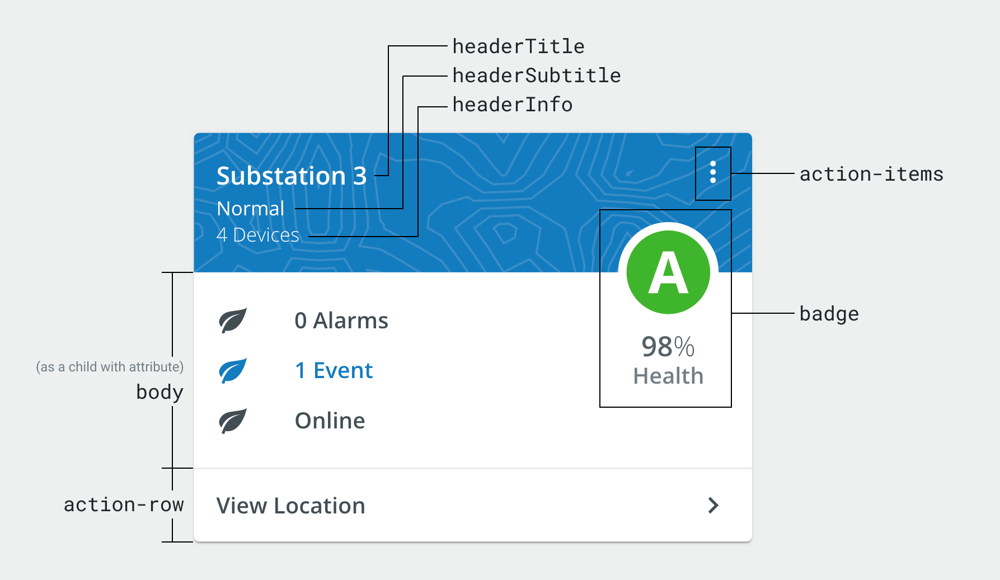

# Score Card

Card component that calls attention to particular values.

<div style="align-items: center; text-align: center; width: 100%; display: flex; justify-content: space-evenly; margin-bottom: 20px">
    <br/>
    <br/>
</div>

## Usage

<div style="width: 100%; text-align: center">
    
</div>

```typescript
// app.module.ts
import { ScoreCardModule } from '@pxblue/angular-components';
...
imports: [
    ScoreCardModule
],
...
```

```html
// Example with basic body content, action items, and a score badge

<pxb-score-card
    [headerTitle]="'Substation 3'"
    [headerSubtitle]="'Normal'"
    [headerInfo]="'4 Devices'"
    [badgeOffset]="-76"
>
    <ng-container action-items>
        <mat-icon>search</mat-icon>
        <mat-icon>more_vert</mat-icon>
    </ng-container>

    <mat-list body>
        <mat-list-item>Body Content</mat-list-item>
    </mat-list>

    <pxb-hero
        badge
        [label]="'Grade'"
        [value]="'98'"
        [units]="'/100'"
        [iconSize]="'large'"
        [iconBackgroundColor]="'white'"
    >
        <i primary class="pxb-grade_a"></i>
    </pxb-hero>
</pxb-score-card>
```

## API

Parent element (`pxb-score-card`) attributes:

<div style="overflow: auto;">

| Attributes     | Description                           | Type         | Required | Default |
| -------------- | ------------------------------------- | ------------ | -------- | ------- |
| badge          | Content to render in the callout area | `ng-content` | no       |         |
| badgeOffset    | Vertical offset for the badge content | `number`     | no       | 0       |
| headerInfo     | Tertiary text                         | `string`     | no       |         |
| headerSubtitle | The secondary text                    | `string`     | no       |         |
| headerTitle    | The primary text                      | `string`     | yes      |         |

</div>

Child element with attributes:

<div style="overflow: auto;">

| Attributes  | Description                                 | Required | Default |
| ----------- | ------------------------------------------- | -------- | ------- |
| actionItems | Icons shown to the right of the header text | no       |         |
| actionRow   | Content to render for the footer            | no       |         |
| body        | Content to render in the body               | no       |         |

</div>
