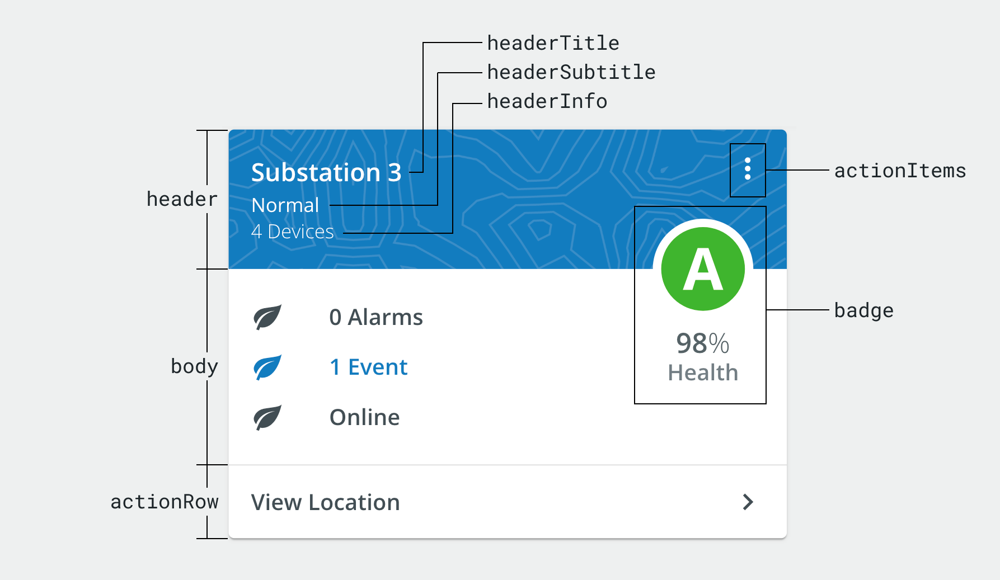

# ScoreCard
Card component that calls attention to particular values.

<div style="align-items: center; text-align: center; width: 100%; display: flex; justify-content: space-evenly; margin-bottom: 20px">
    <br/>
    <br/>
</div>

## Usage

<div style="align-items: center; text-align: center; width: 100%; display: flex; justify-content: space-evenly; margin-bottom: 20px">
    <br/>
</div>

```typescript
// app.module.ts
import { ScoreCardModule } from '@pxblue/angular-components';
...
imports: [
    ScoreCardModule
  ],
...
```

```typescript
// Example with basic body content, action items, and a score badge
<pxb-scorecard 
  [headerTitle]="'Substation 3'"
  [headerSubtitle]="'Normal'"
  [headerInfo]="'4 Devices'"
  [badgeOffset]="-76"
>
    <ng-container action-items>
        <mat-icon>search</mat-icon>
        <mat-icon>more_vert</mat-icon>
    </ng-container>

    <mat-list body>
        <mat-list-item>Body Content</mat-list-item>
    </mat-list>

    <pxb-hero badge [label]="'Grade'" [value]="'98'" [units]="'/100'" [iconSize]="72" [iconBackgroundColor]="colors.white[50]">
        <i primary class="pxb-grade_a"></i>
    </pxb-hero>
</pxb-scorecard>
```

## API

<div style="overflow: auto;">

| Prop Name             | Description                                 | Type                  | Required | Default                      |
|-----------------------|---------------------------------------------|-----------------------|----------|------------------------------|
| actionItems           | Icons shown to the right of the header text | `ng-content`          | no       |                              |
| actionRow             | Content to render for the footer            | `ng-content`          | no       |                              |
| badge                 | Content to render in the callout area       | `ng-content`          | no       |                              |
| badgeOffset           | Vertical offset for the badge content       | `number`              | no       | 0                            |
| body                  | Content to render in the body               | `ng-content`          | no       |                              |
| headerInfo            | Tertiary text                               | `string`              | no       |                              |
| headerTitle           | The primary text                            | `string`              | no       |                              |
| headerSubtitle        | The secondary text                          | `string`              | no       |                              | 

</div>
