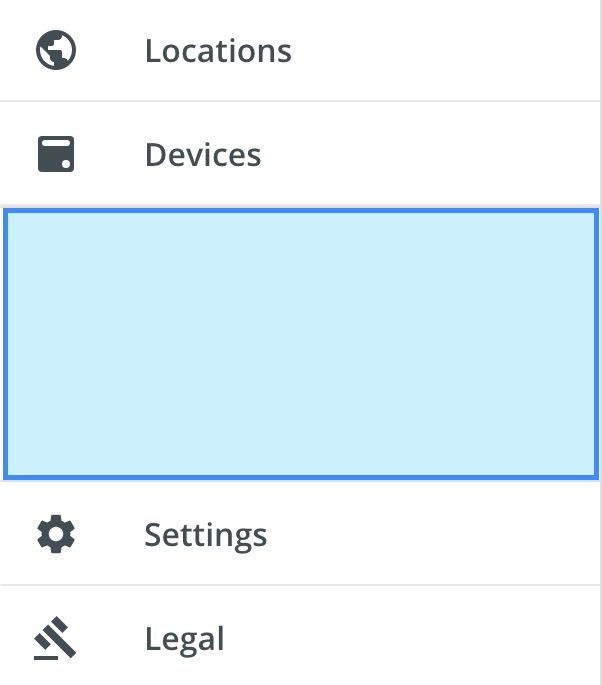

# Spacer
An invisible utility component that acts as a spacer element in various layouts. It works with flexbox sizing or fixed sizing.

<div style="width: 100%; text-align:center">
    <br/>
</div>


## Usage
```typescript
// app.module.ts
import { SpacerModule } from '@pxblue/angular-components';
...
imports: [
    SpacerModule
  ],
...
```

```typescript
// using flex layout
<pxb-spacer flex="1"></pxb-spacer>
// using pixels
<pxb-spacer width="50"></pxb-spacer>
```

## API

<div style="overflow: auto;">

| Prop Name | Description                             | Type     | Required | Default |
|-----------|-----------------------------------------|----------|----------|---------|
| flex      | Flex grow/shrink value for flex layouts | `number` | no       | 0       |
| height    | Height (in px) for static layouts       | `number` | no       |         |
| width     | Width (in px) for static layouts        | `number` | no       |         |

</div>
