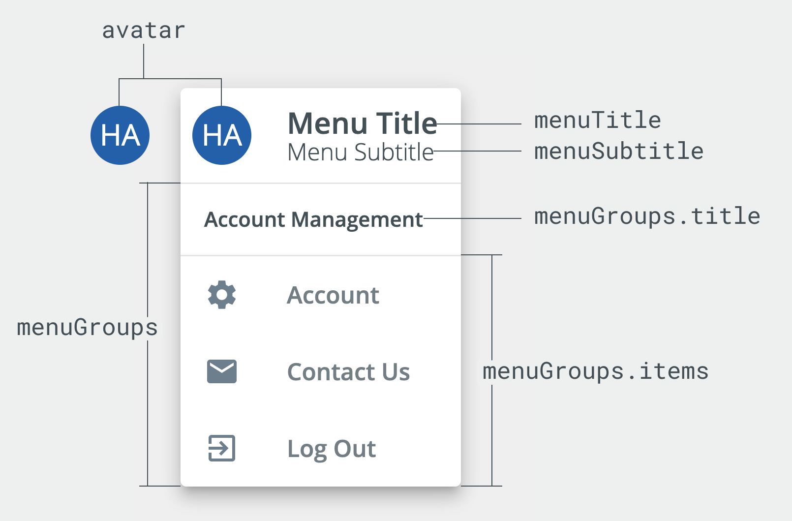
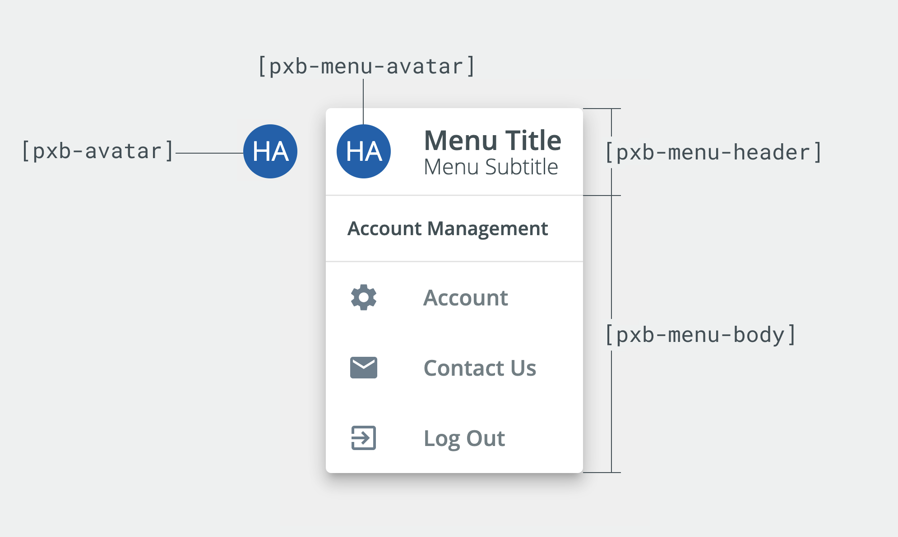

# User Menu

The `<blui-user-menu>` is an Avatar that opens a Menu when clicked. It is typically used in the top-right corner of an application and indicates who is logged in.

<div style="align-items: center; display:flex; justify-content: space-around">


</div>

The Menu header can be constructed by supplying a `menuTitle` and optional `menuSubtitle`, or your own custom content. The Menu body is entirely custom content. See the API section below for more details.

## Usage

<div style="width: 100%; text-align: center">
    
    
</div>

```typescript
// app.module.ts
import { UserMenuModule, InfoListItemModule } from '@brightlayer-ui/angular-components';
...
imports: [
    UserMenuModule,
    InfoListItemModule
],
...
```

```ts
let open = false;
const items = [
    {
        title: 'Account',
        icon: 'settings',
    },
    {
        title: 'Contact Us',
        icon: 'mail',
    },
    {
        title: 'Log Out',
        icon: 'logout',
    },
];
```

```html
// your-component.html
<blui-user-menu avatarValue="HA" menuTitle="Sample Title" [(open)]="open">
    <mat-nav-list blui-menu-body>
        <blui-info-list-item *ngFor="let item of items" [dense]="true" (click)="open=false">
            <mat-icon blui-icon>{{item.icon}}</mat-icon>
            <div blui-title>{{item.title}}</div>
        </blui-info-list-item>
    </mat-nav-list>
</blui-user-menu>
```

## API

Parent element (`<blui-user-menu>`) attributes:

<div style="overflow: auto;">

| @Input           | Description                                                                                                         | Type                       | Required | Default                                                                                                                |
| ---------------- | ------------------------------------------------------------------------------------------------------------------- | -------------------------- | -------- | ---------------------------------------------------------------------------------------------------------------------- |
| avatarImage      | Image source for avatar                                                                                             | `string`                   | no       |                                                                                                                        |
| avatarValue      | Text value for avatar                                                                                               | `string`                   | no       |                                                                                                                        |
| menuSubtitle     | Subtitle shown when menu is open                                                                                    | `string`                   | no       |                                                                                                                        |
| menuTitle        | Title shown when menu is open                                                                                       | `string`                   | no       |                                                                                                                        |
| open             | Controls whether the user menu is opened or closed                                                                  | `boolean`                  | yes      |                                                                                                                        |
| positions        | Where to render the menu relative to the avatar                                                                     | `ConnectionPositionPair[]` | no       | `[new ConnectionPositionPair(` `{ originX: 'start',` `originY: 'top' } ,` `{ overlayX: 'start',` `overlayY: 'top' })]` |
| useBottomSheetAt | Window pixel width at which the responsive bottom sheet menu is triggered (set to 0 to disable responsive behavior) | `number`                   | no       | `600`                                                                                                                  |

</div>

<div style="overflow: auto;">

| @Output       | Description                               | Type                    |
| ------------- | ----------------------------------------- | ----------------------- |
| backdropClick | Emits event when backdrop is clicked      | `EventEmitter<void>`    |
| openChange    | Emits an event when the open prop changes | `EventEmitter<boolean>` |

</div>

The following child elements are projected into `<blui-user-menu>`:

<div style="overflow: auto;">

| Selector           | Description                                                               | Required |
| ------------------ | ------------------------------------------------------------------------- | -------- |
| [blui-avatar]      | Custom avatar to show, alternative to `avatarImage` or `avatarValue` prop | no       |
| [blui-menu-avatar] | Custom menu avatar to show                                                | no       |
| [blui-menu-header] | Custom menu header content                                                | no       |
| [blui-menu-body]   | Custom menu body content                                                  | no       |

</div>

### Classes

Each Brightlayer UI component has classes which can be used to override component styles:

| Name                                | Description                                 |
| ----------------------------------- | ------------------------------------------- |
| blui-user-menu-avatar               | Styles applied to avatar element            |
| blui-user-menu-overlay              | Styles applied to the menu overlay          |
| blui-user-menu-header               | Styles applied to the generated menu header |
| blui-user-menu-header-avatar        | Styles applied to the menu header avatar    |
| blui-user-menu-overlay-backdrop     | Styles applied to the menu overlay backdrop |
| blui-user-menu-bottomsheet          | Styles applied to the bottomsheet overlay   |
| blui-user-menu-bottomsheet-backdrop | Styles applied to the bottomsheet backdrop  |
