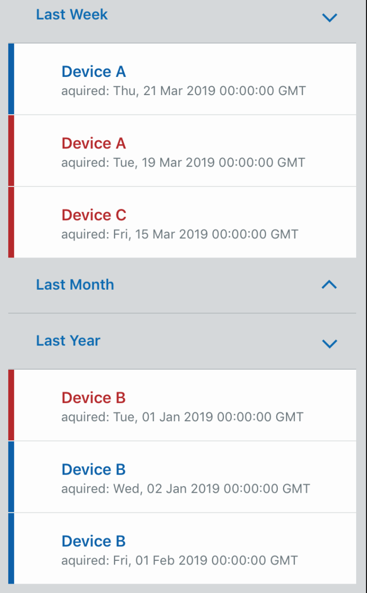

# BucketView

A component to handle grouping related data together and rendering them as a list in CollapsibleSections.



## Examples

### Sorting labels using `compareGroupLabels`

Allows groups to be sorted automatically. This is useful when there are a large number of groups, or when the group labels are not known ahead of time.

```
<BucketView
  data={[{ name: 'Device A', status: 'started', date: new Date('2019-03-21') } /* ... */]}
  getGroupLabel={device => device.name}
  compareGroupLabels={(a, b) => a.localeCompare(b)}
  renderItem={device => <InfoListItem title={device.name} />}
  ItemSeparatorComponent={Separator}
/>
```

### Sorting labels using `labels`

Allows explicitly defining the order of group labels to be shown. This is useful when there are a small number of known group labels.

```
<BucketView
  data={[{ name: 'Device A', status: 'started', date: new Date('2019-03-21') } /* ... */]}
  getGroupLabel={device => device.name}
  labels={['Device A', 'Device B']}
  renderItem={device => <InfoListItem title={device.name} />}
  ItemSeparatorComponent={Separator}
/>
```

## Props

| Name                   | Type                                    | Required | Default | Examples                                               | Notes                                                                                  |
|------------------------|-----------------------------------------|----------|---------|--------------------------------------------------------|----------------------------------------------------------------------------------------|
| data                   | `Array<T>`                                | yes      |         | [{ value: 'a', count: 1 }, { value: 'b', count: 100 }] |                                                                                        |
| renderIcon             | `(data: T) => JSX.Element`               | yes      |         | `data => <InfoListItem title={data.value}` />   |                                                                                        |
| getGroupLabel          | `(data: T) => string`                     | yes      |         | `data => data.count < 50 ? 'small' : 'large'`         |                                                                                        |
| groupLabels            | `Array<string>`                           | no       |         | ['small', 'large']                                     | If present, groups will be shown in the order they appear in this array                |
| compareGroupLabels     | `(a: string, b: string) => number`        | no       |         | `(a, b) => a.value.compareTo(b.value)`                | If present and `groupLabels` is not, this will be used to sort the group labels shown  |
| compareData            | `(a: T, b: T) => number`                  | no       |         | `(a, b) => a.count - b.count`                         | Determines sorting within each group                                                   |
| style                  | `StyleProp<ViewStyle>`                    | no       |         | { padding: 10, backgroundColor: green[200] }           | A style applied to the top-level child component                                       |
| ItemSeparatorComponent | `FunctionComponent | ComponentClass` | no       |         | `() => <View />`                                | An optional separator component to be rendered between items in the CollapsibleSection |
