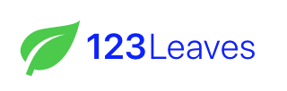

# ChannelValue

The ChannelValue component is used to display...a channel value (and units). This component abstracts the styles used to display the channel and units as well as an optional inline icon. These are used as part of the [Hero](./Hero.md) component, but can also be used inline (e.g., in a list)

Note: If provided, the IconClass must be a React.ComponentClass or React.FunctionComponent with props of `{ size: number, color: string }`. This library exposes a `wrapIcon` higher-order function that can convert components from `react-native-vector-icons` or from `@pxblue/icons-svg` to this format.



## Example
```
import { ChannelValue } from '@pxblue/react-native-components';
import Leaf from '@pxblue/icons-svg/leaf.svg';

const WrappedLeaf = wrapIcon({ IconClass: Leaf });

...

<ChannelValue value={100} units={'%'} IconClass={<WrappedLeaf />} />
```

## Props

| Name      | Type                                             | Required | Default | Examples              |
|-----------|--------------------------------------------------|----------|---------|-----------------------|
| value     | string &vert; number                             | yes      |         | 123, 'on'             |
| IconClass | React.Component<{ size: number, color: string }> | no       |         | &lt;WrappedLeaf /&gt; |
| units     | string                                           | no       |         | 'hz', '$'             |
| prefix    | boolean                                          | no       | false   | true, false           |
| fontSize  | number                                           | no       | 20      | 12, 30                |
| color     | string                                           | no       | 'black' | 'black', '#000000'    |
