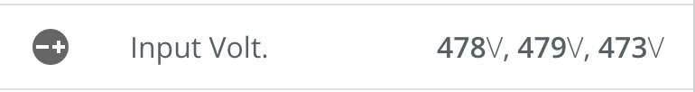

# ChannelValue Component
The ChannelValue component is used to display...a channel value (and units). This component abstracts the styles used to display the channel and units as well as an optional inline icon. These are used as part of the [Hero](./Hero.md) component, but can also be used inline (e.g., in a list).




## Usage
```
import ChannelValue from '@pxblue/react-components/core/ChannelValue';
...
<ChannelValue value={100} units={'%'} icon={<Icon/>} />
```

## Available properties
* ```value``` (Number, String)[**required**]: the value (bold text) to display.
* ```units``` (String): the text to display for the units (light text).
* ```icon``` (Element): the inline icon to display.
* ```prefix``` (Boolean): whether to show the units before the value. **Default**: false.
