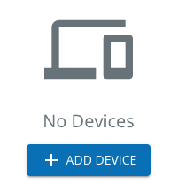

# EmptyState
The Empty State component is an element that can be used as a placeholder when no data is present (such as an empty list, or a placeholder page for future content). This is only used when no data is available, rather than during loading (see [empty states pattern](https://pxblue.github.io/patterns/empty-states)).



## Usage
```typescript
import { EmptyState } from '@pxblue/react-components';

<EmptyState
    icon={<AlertIcon style={{ fontSize: '100px', marginBottom: '15px' }} />}
    title={"No Alarms Found"}
/>
```
 
## API
| Prop Name   | Description                             | Type              | Required | Default | Examples                              |
|-------------|-----------------------------------------|-------------------|----------|---------|---------------------------------------|
| title       | The main text to display                | `string`          | yes      |         | 'No Data Found'                       |
| description | The secondary text to display           | `string`          | no       |         | 'Come back to this page later'        |
| icon        | The primary icon                        | `React.Component` | no       |         | `<DevicesIcon fontSize={'inherit'}/>` |
| actions     | Additional components to render below   | `React.Component` | no       |         | `<Button>Add Device</Button>`         |

