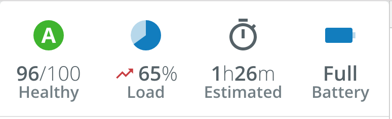

# Hero Components
The PX Blue Hero components are used to call attention to particular values that are of the most importance to the user. These are typically displayed in a banner.



## HeroBanner
The HeroBanner component is a simple wrapper component that is used to contain ```<Hero/>```s. It creates the flex container and sets up the spacing rules to display them. It accepts up to four ```<Hero/>``` components as its children.

### Usage
```
import HeroBanner from '@pxblue/react-components/core/HeroBanner';
import Hero from '@pxblue/react-components/core/Hero';
...
<HeroBanner divider>
    <Hero/>
    <Hero/>
    <Hero/>
    <Hero/>
</HeroBanner>
```

### Available properties
* ```divider``` (Boolean): whether or not to show the dividing line below the banner. **Default**: false.

## Hero
The Hero component displays a particular icon, value/units, and a label. The icon property will accept any valid component - this will typically be a Material icon, PX Blue icon, or Progress Icon. It will also accept Text/Emoji values.

The value section of the Hero utilizes a [ChannelValue](./ChannelValue.md) component. To display a single simple value, the information can be passed as props (```value```, ```units```, ```valueIcon```). For more complex values (such as a duration that displays hours and minutes), you can pass in ```<ChannelValue>``` components as children and they will be displayed inline.

### Usage
```
import Hero from '@pxblue/react-components/core/Hero';

// Simple usage passing props
<Hero
    icon={<Icon/>}
    label={'Label'}
    value={99}
    units={'%'}
/>
// Complex example with multiple values as children
<Hero
    icon={<Icon/>}
    label={'Label'}
>
    <ChannelValue value={1} units={'h'} />
    <ChannelValue value={26} units={'m'} />
</Hero>
```

### Available properties
* ```icon``` (Element, String)[**required**]: a React Component (e.g., Material Icon) or string value to display.
* ```label``` (String)[**required**]: text to display below the value. 
* ```iconSize``` (Number): the size of the icon in pixels. **Default**: 36. **Max**: 72. **Min**: 10
* ```fontSize``` ("normal", "small"): the font size to use for the ```ChannelValue```. **Default**: "normal".
* ```value``` (Number, String): when displaying a single ```ChannelValue```, the value.
* ```units``` (String): when displaying a single ```ChannelValue```, the units.
* ```valueIcon``` (Element): when displaying a single ```ChannelValue```, the inline icon to display.