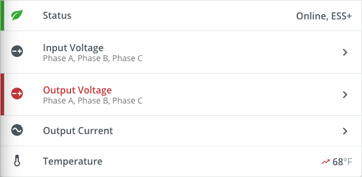

# InfoListItem
The InfoListItem is intended to be used in List views. It positions a title as well as optional subtitle(s), icon, and status stripe.



## Usage
```typescript
import { InfoListItem } from '@pxblue/react-components';
import { GradeA, Leaf, CurrentCircled, VoltageCircled, Temp } from '@pxblue/icons-mui';
import * as Colors from '@pxblue/colors';
...
<InfoListItem
    title={'Status'}
    divider={'full'}
    statusColor={Colors.green[500]}
    subtitleSeparator={'/'}
    icon={<Leaf color={'inherit'} />}
/>
```

### API
| Prop Name         | Description                             | Type                                               | Required | Default             | Examples                                |
|-------------------|-----------------------------------------|----------------------------------------------------|----------|---------------------|-----------------------------------------|
| avatar            | Show colored background for icon        | `boolean`                                          | no       | false               |                                         |
| backgroundColor   | The color used for the background       | `string`                                           | no       |                     | 'white', 'blue'                         |
| chevron           | Add a chevron icon on the right         | `boolean`                                          | no       | false               |                                         |
| dense             | Smaller height row with less padding    | `boolean`                                          | no       | false               |                                         |
| divider           | Show a row separator below the row      | 'full' &vert; 'partial'                            | no       |                     |                                         |
| fontColor         | Title text color                        | `string`                                           | no       |                     | '#ff3333', 'orange'                     |
| hidePadding       | Remove left padding if no icon is used  | `boolean`                                          | no       | false               |                                         |
| icon              | A component to render for the icon      | `React.Component`                                  | no       |                     | `<Leaf color={'inherit'} />`            |
| iconColor         | Color override for the row icon         | `string`                                           | no       |                     |                                         |
| leftComponent     | Component to render on the left side    | `React.Component`                                  | no       |                     | `<ListItemText/>`                       |
| onClick           | A function to execute when clicked      | `function`                                         | no       |                     | `() => console.log('pressed')`          |
| rightComponent    | Component to render on the right side   | `React.Component`                                  | no       |                     | `<ChannelValue/>`                       |
| statusColor       | Status stripe and icon color            | `string`                                           | no       |                     | '#ff3333', 'orange'                     |
| subtitle          | The text to show on the second line     | `string` &vert; `Array<React.ReactNode>`           | no       |                     | 'Subtitle', ['one', 'two', <Leaf/>]     |
| subtitleSeparator | Separator character for subtitle        | `string`                                           | no       | '·' ('\u00B7')      | '-', '/'                                |
| title             | The text to show on the first line      | `string`                                           | yes      |                     | 123, 'on'                               |

