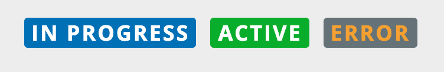

# ListItemTag
ListItemTag is a text item with a colored background and rounded corners that is used to tag lists.



### Usage

```typescript
import { ListItemTag } from '@pxblue/react-components';

<ListItemTag label={"Foo Bar"} backgroundColor={'gold'} fontColor={'black'} />
```

### API

Besides what's listed below, as an extension of [Material UI's Typography API](https://material-ui.com/api/typography/), the component will pass in all extra props.

| Prop Name       | Description                   | Type     | Required | Default   | Example   |
| --------------- | ----------------------------- | -------- | -------- | --------- | --------- |
| label           | The label text                | `string` | yes      |           | `'Foo'`   |
| fontColor       | Color of the label            | `string` | no       | `#ffffff` | `'white'` |
| backgroundColor | Color of the label background | `string` | no       | `#007bc1` | `'green'` ||
