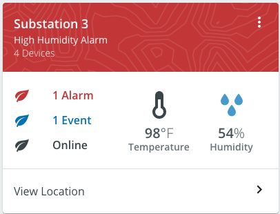
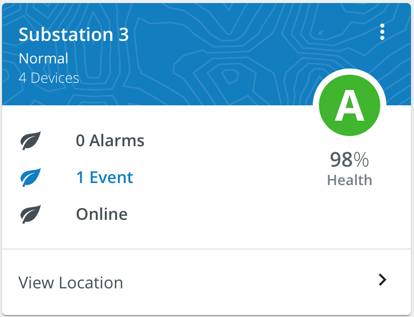

# Score Card
Card component that calls attention to particular values.

<br/>
<br/>

### Usage
```
import { Hero, HeroBanner, ScoreCard } from '@pxblue/react-native-components';
import { List, Card, ListItem, ListItemText, ListItemSecondaryAction } from '@material-ui/core';
import * as Colors from '@pxblue/colors';
import { MoreVert } from '@material-ui/icons';
import { Temp } from '@pxblue/icons-mui';

...
<ScoreCard
    headerColor={Colors.red[500]}
    headerTitle={'Substation 3'}
    headerFontColor={Colors.white[50]}
    actionItems={[
        <MoreVert onClick={() => {}} />,
    ]}
    badge={
        <HeroBanner>
            <Hero
                icon={<Temp fontSize={'inherit'} htmlColor={Colors.black[500]} />}
                label={'Temperature'}
                iconSize={48}
                value={98}
                units={'°F'}
                fontSize={'normal'}
            />
        </HeroBanner>
    }
    actionRow={
        <List>
            <ListItem>
                <ListItemText primary="View Location" />
                <ListItemSecondaryAction> <ChevronRight /> </ListItemSecondaryAction>
            </ListItem>
        </List>
    }
>
    {/* Card Body Content */}
</ScoreCard>
```

### API
| Prop Name             | Description                                 | Type                  | Required | Default                      | Examples                              |
|-----------------------|---------------------------------------------|-----------------------|----------|------------------------------|---------------------------------------|
| headerTitle           | The primary text                            | `string`              | yes      |                              | 'Dos Valley Field'                    |
| headerSubtitle        | The secondary text                          | `string`              | no       |                              | '5 Devices                            |
| headerInfo            | Tertiary text (hidden on collapse)          | `string`              | no       |                              | 'Online'                              |
| headerColor           | The color of the header                     | `string`              | no       | `theme.palette.primary[500]` | 'red'                                 |
| headerFontColor       | The color for text and icons in header      | `string`              | no       | `white`                      | '#000000'                             |
| headerBackgroundImage | An image to display in the header           | `string`              | no       |                              | `import bg from './path/to/image.png'`|
| actionItems           | Icons to show to the right of the text      | `JSX.Element[]`       | no       |                              |                                       |
| badge                 | The component to render in the callout area | `React.Component`     | no       |                              | `<HeroBanner><Hero/></HeroBanner>`    |
| badgeOffset           | Vertical offset for the badge component     | `number`              | no       |                              | -55                                   |
| actionRow             | Component to render for the footer          | `React.Component`     | no       |                              | `<ListItem/>`                         |