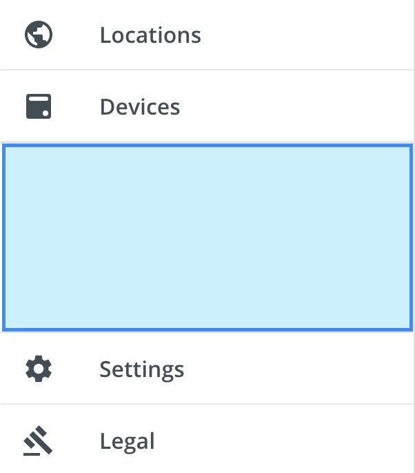

# Spacer
An invisible utility component that acts as a spacer element in various layouts. It works with flexbox sizing or fixed sizing.

<br/>

### Usage
```
import { Spacer } from '@pxblue/react-components';
...
<div style={{display: 'flex'}}>
    {/* Left Content */}
    <Spacer flex={1}/>
    {/* Right Content */}
</div>
```

### API
| Prop Name             | Description                                 | Type                  | Required | Default                      | Examples                              |
|-----------------------|---------------------------------------------|-----------------------|----------|------------------------------|---------------------------------------|
| classes               | Classes object to override styles           | `Object`              | no       |                              | {root: 'customRootClass'}             |
| flex                  | Flex grow/shrink value for flex layouts     | `number`              | no       | 1                            |                                       |
| height                | Height (in px) for static layouts           | `number`              | no       |                              |                                       |
| width                 | Width (in px) for static layouts            | `number`              | no       |                              |                                       |

### Classes
You can override the classes used by PX Blue by passing a `classes` prop. It supports the following keys:

| Name             | Description                                 |
|------------------|---------------------------------------------|
| root             | Styles applied to the root element          |