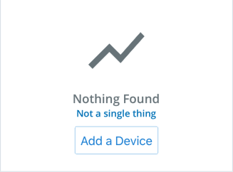

# EmptyState Component
The Empty State component is an element that can be used as a placeholder when no data is present (such as an empty list, or a placeholder page for future content). This is only used when no data is available, rather than during loading (see [empty states pattern](https://pxblue.github.io/patterns/empty-states)).



## Usage
```
import { EmptyState, wrapIcon } from '@pxblue/react-native-components';
import _Battery from '@pxblue/icons-svg/battery.svg';
const Battery = wrapIcon({ IconClass: _Battery });
...
<EmptyState 
    title={'Nothing Found'} 
    description={'Not a single thing'}
    IconClass={Battery} 
/>
```

## API
| Prop Name   | Description                             | Type                                               | Required | Default | Examples                        |
|-------------|-----------------------------------------|----------------------------------------------------|----------|---------|---------------------------------|
| title       | The main text to display                | `string`                                           | yes      |         | 'No Data Found'                 |
| description | The secondary text to display           | `string`                                           | no       |         | 'Come back to this page later'  |
| IconClass   | The primary icon                        | `React.Component<{ size: number, color: string }>` | yes      |         | `WrappedLeaf`                   |
| iconSize    | The size of the primary icon (100-200)  | `number`                                           | no       | 100     | 24                              |
| iconColor   | The color of the primary icon           | `string`                                           | no       | `text`  | 'red'                           |
| actions     | Additional components to render below   | `JSX.Element`                                      | no       |         | `<Button title={'click me'} />` |

