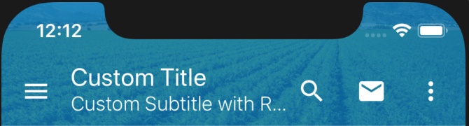
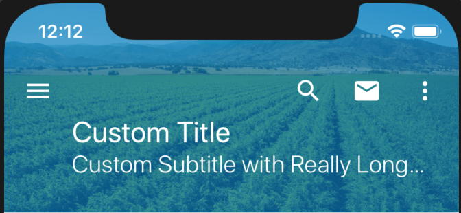

# Header
The header component is used at the top of the page to display page information. It shows a title and has optional parameters to show a subtitle, background image, navigation button, and multiple action buttons. The header can also be configured to expand/collapse as desired.




### Usage
```
import { Header } from '@pxblue/react-native-components';
import Icon from 'react-native-vector-icons/MaterialIcons';
const MenuIcon = wrapIcon({IconClass: Icon, name:'menu'});
const MoreIcon = wrapIcon({IconClass: Icon, name:'more-vert'});
...
<Header
    title={'Valley Forge'}
    subtitle={'The Last Stand'}
    navigation={{icon: MenuIcon, onPress: () => {}}}
    actionItems={[
        {icon: MoreIcon, onPress: () => {}}
    ]}
/>
```

### API
| Prop Name         | Description                             | Type                  | Required | Default                  | Examples                                   |
|-------------------|-----------------------------------------|-----------------------|----------|--------------------------|--------------------------------------------|
| title             | The text to show on the first line      | `string`              | yes      |                          | 'Hello World'                              |
| subtitle          | The text to show on the second line     | `string`              | no       |                          | 'Subtitle'                                 |
| info              | Third line of text (hidden on collapse) | `string`              | no       |                          | 'Hidden Text'                              |
| navigation        | Icon to show left of the title          | `HeaderIcon`          | no       |                          | `{icon: MenuIcon, onClick: () => {}}`      |
| actionItems       | Icons to show to the right of the title | `HeaderIcon[]`        | no       |                          |                                            |
| expandable        | Allow the header to expand/collapse     | `boolean`             | no       | `false`                  |                                            |
| startExpanded     | Default the header to expanded          | `boolean`             | no       | `false`                  |                                            |
| backgroundColor   | The color used for the background       | `string`              | no       | `theme.colors.primary`   | 'white', 'blue'                            |
| fontColor         | The color used for the text             | `string`              | no       | `theme.colors.onPrimary` | '#000000'                                  |
| backgroundImage   | An image to display in the header       | `ImageSourcePropType` | no       |                          | `require('../assets/background.jpg')`      |
| searchableConfig  | Configuration for search behavior       | `SearchableConfig`    | no       |                          | { placeholder: 'Search', autoFocus: true } |
| theme             | Theme partial for default styling       | `DeepPartial<Theme>`  | no       |                          | { colors: { text: 'green' } }              |

#### HeaderIcon
Header icons specified as a JSON object with the following properties:
| Key               | Description                             | Type                                               | Required | Default             | Examples                                |
|-------------------|-----------------------------------------|----------------------------------------------------|----------|---------------------|-----------------------------------------|
| icon              | A component to render for the icon      | `React.Component<{ size: number, color: string }>` | yes      |                     | `WrappedLeaf`                           |
| onPress           | A function to execute when clicked      | `function`                                         | yes      |                     | `() => console.log('pressed')`          |

#### SearchableConfig
SearchableConfig is an optional object used to configure the search functionality of the header component. It is a JSON object with the following properties:

| Key               | Description                             | Type                                               | Required | Default             | Examples                                |
|-------------------|-----------------------------------------|----------------------------------------------------|----------|---------------------|-----------------------------------------|
| icon              | An override for the default search icon | `React.Component<{ size: number, color: string }>` | no       | `SearchIcon`        | `WrappedLeaf`                           |
| placeholder       | Helper text shown in search field       | `string`                                           | no       | 'Search'            | 'Search by Device'                      |
| autoFocus         | Gives focus to search input when opened | `boolean`                                          | no       | `false`             |                                         |
| onChangeText      | Callback when search text changes       | `function`                                         | no       | `null`              | `() => console.log('pressed')`          |
| autoCapitalize    | Auto-capitalize search input            | [`TextInput.autoCapitalize`](shorturl.at/vzKR7)    | no       | 'none'              | 'words'                                 |
| autoCorrect       | Auto-correct search input               | `boolean`                                          | no       | `false`             |                                         |