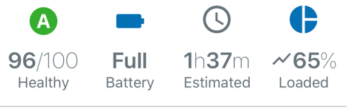

# Hero Components
Hero items are used to call attention to particular values.



## Hero
The Hero component displays a particular icon, value/units, and a label. The [IconClass](./iconWrapper.md) property will accept any valid icon from @pxblue/icons-svg or react-native-vector-icons.

> In the future this component will be extended to work with other graphic types, including progress icons, text, and emojis.

The value section of the Hero utilizes a [ChannelValue](./channel-value.md) component. To display a single simple value, the information can be passed as props (```value```, ```units```, ```valueIcon```). For more complex values (such as a duration that displays hours and minutes), you can pass in ```<ChannelValue/>``` components as children and they will be displayed inline.

### Hero Usage
```
import { Hero, wrapIcon } from '@pxblue/react-native-components';
import _Battery from '@pxblue/icons-svg/battery.svg';
const Battery = wrapIcon({ IconClass: _Battery });
...
<Hero 
    label={'Charge'}
    icon={Battery}
    value={100}
    units={'%'}
/>
```

### Hero API
| Prop Name           | Description                             | Type                                                               | Required | Default                | Examples                       |
|---------------------|-----------------------------------------|--------------------------------------------------------------------|----------|------------------------|--------------------------------|
| label               | The text shown below the `ChannelValue` | `string`                                                           | yes      |                        | 'Status'                       |
| IconClass           | The primary icon                        | `React.Component<{ size: number, color: string }>`                 | yes      |                        | `WrappedLeaf`                  |
| iconSize            | The size of the primary icon (10-48)    | `number`                                                           | no       | 36                     | 24                             |
| iconColor           | The color of the primary icon           | `string`                                                           | no       | `text`                 | 'red'                          |
| iconBackgroundColor | The color behind the primary icon       | `string`                                                           | no       | `theme.colors.surface` | 'red'                          |
| fontSize            | The text size for the value line        | keyof [`theme.sizes`](./theme.md)                                  | no       | 'large'                | 'medium'                       |
| value               | The value for the channel               | `string` &vert; `number`                                           | no       |                        | 240, 'Off'                     |
| ValueIconClass      | The icon to show inline with the value  | `React.Component<{ size: number, color: string }>`                 | no       |                        | `WrappedLeaf`                  |
| valueColor          | Text color for the value line           | `string`                                                           | no       | `text`                 | 'primary                       |
| units               | Text to show after the value            | `string`                                                           | no       |                        | 'Hz', '$'                      |
| onPress             | A function to execute when clicked      | `function`                                                         | no       |                        | `() => console.log('pressed')` |
| theme               | Theme partial for default styling       | `DeepPartial<Theme>`                                               | no       |                        | { colors: { text: 'green' } }  |


## Hero Banner
The HeroBanner component is a simple wrapper component that is used to contain `<Hero/>`s. It creates the flex container and sets up the spacing rules to display them. It accepts up to four `<Hero/>` components by default as children. Any children after the ```limit``` will not be rendered.

### Hero Banner Usage
```
import { Hero, HeroBanner, wrapIcon } from '@pxblue/react-native-components';
import _Battery from '@pxblue/icons-svg/battery.svg';
const Battery = wrapIcon({ IconClass: _Battery });
...
...
<HeroBanner divider>
    <Hero label={'Hero One'} IconClass={Battery}/>
    <Hero label={'Hero Two'} IconClass={Battery}/>
    <Hero label={'Hero Three'} IconClass={Battery}/>
    <Hero label={'Hero Four'} IconClass={Battery}/>
</HeroBanner>
```

### Hero Banner API
| Prop Name | Description                             | Type      | Required | Default | Examples |
|-----------|-----------------------------------------|-----------|----------|---------|----------|
| divider   | Whether to show the line separator      | `boolean` | no       | false   |          |
| limit     | Max number of children to display       | `number`  | no       | 4       | 3        |