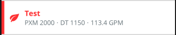

# InfoListItem
The InfoListItem is intended to be used in List views. It positions a title as well as optional subtitle(s), icon, and status stripe. The [IconClass](./iconWrapper.md) property will accept any valid icon from @pxblue/icons-svg or react-native-vector-icons.



### Usage
```
import Leaf from '@pxblue/icons-svg/leaf.svg';
import { wrapIcon } from '@pxblue/react-native-components';
const LeafIcon = wrapIcon({ IconClass: Leaf });
...
<InfoListItem
    title={'Title'}
    IconClass={LeafIcon}
    subtitle={'A subtitle'}
    statusColor={PXBColors.red[500]}
    backgroundColor={PXBColors.blue[50]}
/>
```
#### Advanced Usage
You can also supply an array of items that will be displayed as a character-separated subtitle. The separation character is configurable.

```
<InfoListItem
    title={'Hillman Field East'}
    subtitle={['PXM 2000', 'DT 1150', '113.4 GPM']}
    subtitleSeparator={'/'}
/>
```

### API
| Prop Name         | Description                             | Type                                               | Required | Default             | Examples                                |
|-------------------|-----------------------------------------|----------------------------------------------------|----------|---------------------|-----------------------------------------|
| title             | The text to show on the first line      | `string`                                           | yes      |                     | 123, 'on'                               |
| subtitle          | The text to show on the second line     | `string` &vert; `Array<React.ReactNode>`           | no       |                     | 'Subtitle', ['one', 'two', <LeafIcon/>] |
| subtitleSeparator | Separator character for subtitle        | `string`                                           | no       | '·' ('\u00B7')      | '-', '/'                                |
| IconClass         | A component to render for the icon      | `React.Component<{ size: number, color: string }>` | no       |                     | `WrappedLeaf`                           |
| iconColor         | The color of the primary icon           | `string`                                           | no       |                     | 'red'                                   |
| hidePadding       | Remove left padding if no icon is used  | `boolean`                                          | no       | false               |                                         |
| avatar            | Show colored background for icon        | `boolean`                                          | no       | false               |                                         |
| chevron           | Add a chevron icon on the right         | `boolean`                                          | no       | false               |                                         |
| dense             | Smaller height row with less padding    | `boolean`                                          | no       | false               |                                         |
| divider           | Show a row separator below the row      | 'full' &vert; 'partial'                            | no       |                     |                                         |
| rightComponent    | Component to render on the right side   | `JSX.Element`                                      | no       |                     | `<ChannelValue/>`                       |
| statusColor       | Status stripe and icon color            | `string`                                           | no       |                     | '#ff3333', 'orange'                     |
| fontColor         | Title text color                        | `string`                                           | no       |                     | '#ff3333', 'orange'                     |
| backgroundColor   | The color used for the background       | `string`                                           | no       |                     | 'white', 'blue'                         |
| onPress           | A function to execute when clicked      | `function`                                         | no       |                     | `() => console.log('pressed')`          |
| theme             | Theme partial for default styling       | `DeepPartial<Theme>`                               | no       |                     | { colors: { text: 'green' } }           |
