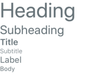

# Typography
Typography components are used to render text on the screen. This library provides several helper components that automatically apply various styles from the theme to avoid repeated custom styling throughout an application.



We provide components for: ```<H1>```, ```<H2>```, ```<H3>```, ```<H4>```, ```<H5>```, ```<H6>```, ```<Label>```, ```<Body>```, ```<Subtitle>```, ```<Caption>```

### Usage
```
import * as Typography from '@pxblue/react-native-components';
...
<View>
    <Typography.H1>Head. 1</Typography.H1>
    <Typography.H2>Heading 2</Typography.H2>
    <Typography.H3>Heading 3</Typography.H3>
    <Typography.H4>Heading 4</Typography.H4>
    <Typography.H5>Heading 5</Typography.H5>
    <Typography.H6>Heading 6</Typography.H6>
    <Typography.Label>Label</Typography.Label>
    <Typography.Body>Body</Typography.Body>
    <Typography.Subtitle>Subtitle</Typography.Subtitle>
    <Typography.Caption>Caption</Typography.Caption>
</View>
```

### API
All typography components in this library share a common API.

| Prop Name | Description                             | Type                               | Required | Default | Examples                      |
|-----------|-----------------------------------------|------------------------------------|----------|---------|-------------------------------|
| font      | The font style (from the theme)         | keyof [`theme.fonts`](./theme.md)  | no       |         | 'bold'                        |
| fontSize  | The font size (from the theme)          | keyof [`theme.sizes`](./theme.md)  | no       |         | 'large'                       |
| color     | The font color (from theme palette)     | keyof [`theme.colors`](./theme.md) | no       | 'text'  | 'primary'                     |
| theme     | Theme partial for default styling       | `DeepPartial<Theme>`               | no       |         | { colors: { text: 'green' } } |