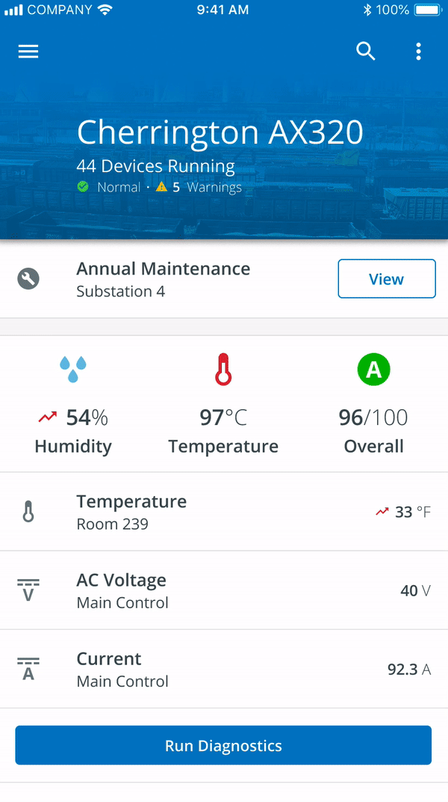
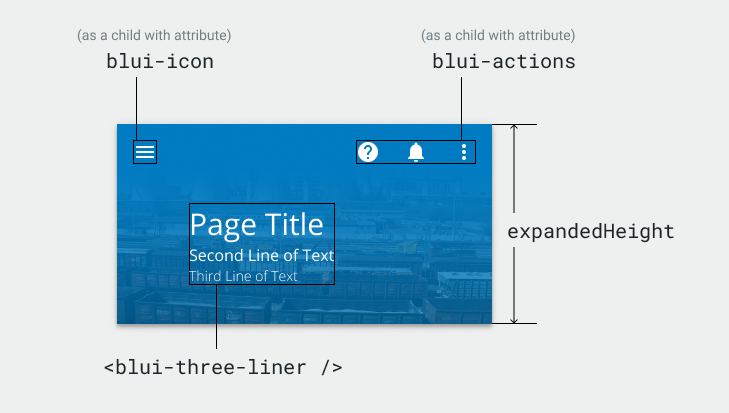

# App Bar

The `<blui-app-bar>` component is a wrapper around the `<mat-toolbar>` that can be resized as the page is scrolled. 
It supports three variants: `snap`, `collapsed`, and `expanded`.

<div style="text-align:center; margin-bottom:20px">
    
    
</div>

## Usage

<div style="width: 100%; text-align: center">
    
    
</div>

```typescript
// app.module.ts
import { AppBarModule } from '@brightlayer-ui/angular-components';
...
imports: [ AppBarModule ]
...
```

```html
// your-component.html 
// Default: AppBar will resize between collapsedHeight and expandedHeight as the window is scrolled
<blui-app-bar variant="snap"></blui-app-bar>

// App Bar will stay fixed at the collapsedHeight size
<blui-app-bar variant="collapsed"></blui-app-bar>

// App Bar will stay fixed at the expandedHeight size
<blui-app-bar variant="expanded"></blui-app-bar>

// AppBar with Three Liner component
<blui-app-bar variant="snap">
    <blui-three-liner title="title" subtitle="subtitle" info="info"></blui-three-liner>
</blui-app-bar>
```

## API

<div style="overflow: auto;">

| @Input                   | Description                                            | Type                                      | Required | Default                          |
| ------------------------ |--------------------------------------------------------| ----------------------------------------- | -------- | -------------------------------- |
| collapsedHeight          | Height of the AppBar when collapsed                    | `number`                                  | no       | theme default                    |
| color                    | Color variant which is passed to the `<mat-toolbar>`   | `'primary'` \| `'accent'` \| `'warn'`     | no       | 'primary'                        |
| expandedHeight           | Height of the AppBar when expanded                     | `number`                                  | no       | 200                              |
| collapsedChange          | Event emitter for when the appbar opens or closes      | `EventEmitter<boolean>`                   | no       |                                  |
| scrollContainerElement   | Scrollable element which dynamic app bar responds to   | `Element`                                 | no       |                                  |
| scrollContainerClassName | Class name, index number of scrollable element         | `{ name: string, index: number }`         | no       |                                  |
| scrollContainerId        | Id of the scrollable element                           | `string`                                  | no       |                                  |
| scrollThreshold          | Distance in pixels to scroll before collapsing toolbar | `number`                                  | no       | expandedHeight - collapsedHeight |
| variant                  | Behavior of the App Bar                                | `'expanded'` \| `'collapsed'` \| `'snap'` | no       | 'collapsed'                      |

</div>

> For the `snap` variant to respond correctly to scroll events, the `scrollContainerElement`, `scrollContainerClassName`, or `scrollContainerId` should be provided.

The following child element is projected into `<blui-app-bar>`:

| Selector       | Description       | Required | Default |
| -------------- | ----------------- | -------- | ------- |
| [blui-actions] | Menu action items | no       |         |
| [blui-icon]    | Menu icon         | no       |         |

### Classes

Each Brightlayer UI component has classes which can be used to override component styles:

| Name                      | Description                                   |
| ------------------------- | --------------------------------------------- |
| blui-app-bar              | Styles applied to the tag                     |
| blui-app-bar-background   | Styles applied to the background image        |
| blui-app-bar-body-wrapper | Styles applied to the toolbar body ng-content |
| blui-app-bar-collapsed    | Styles applied to the app bar when collapsed  |
| blui-app-bar-content      | Styles applied to the root element            |
| blui-app-bar-expanded     | Styles applied to the app bar when expanded   |
