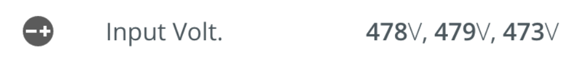

# Channel Value

The `<blui-channel-value>` component is used to display a channel value (and units). This component abstracts the styles used to display the channel and units as well as an optional inline icon. These are used as part of the [`<blui-hero>`](./Hero.md) component, but can also be used inline (e.g., in a list).

Icons are passed in as a child element of the `<blui-channel-value>` component.

<div style="text-align:center; margin-bottom:20px">
    
</div>

## Usage

<div style="width: 100%; text-align: center">
    
</div>

```typescript
// app.module.ts
import { ChannelValueModule } from '@brightlayer-ui/angular-components';
...
imports: [
    ChannelValueModule
],
```

## API

Parent element (`<blui-channel-value>`) attributes:

<div style="overflow: auto;">

| @Input     | Description                                    | Type                             | Required | Default  |
|------------| ---------------------------------------------- | -------------------------------- | -------- |----------|
| prefix     | If true, shows units before the value          | `boolean`                        | no       | false    |
| units      | Text to display for the units                  | `string`                         | no       |          |
| unitSpace* | Show/Hide spacing between the value and units  | `'auto'` \| `'hide'` \| `'show'` | no       | `'auto'`  |
| value      | Text to display for the value                  | `string` \| `number`             | yes      |          |

</div>

> *Setting `unitSpace` to 'auto' will show a space for all units except for '%', '℉', '°C', and '°'. When prefix is true, the space will be shown for all units except for '$'.

The following child element is projected into `<blui-channel-value>`:

| Selector | Description             | Required | Default |
| -------- | ----------------------- | -------- | ------- |
| (child)  | Icons shown on the left | no       |         |

### Classes

Each Brightlayer UI component has classes which can be used to override component styles:

| Name                            | Description                          |
| ------------------------------- | ------------------------------------ |
| blui-channel-value              | Styles applied to the tag            |
| blui-channel-value-content      | Styles applied to the root element   |
| blui-channel-value-icon-wrapper | Styles applied to the icon container |
| blui-channel-value-units        | Styles applied to the units @Input   |
| blui-channel-value-value        | Styles applied to the value @Input   |
