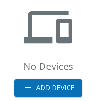
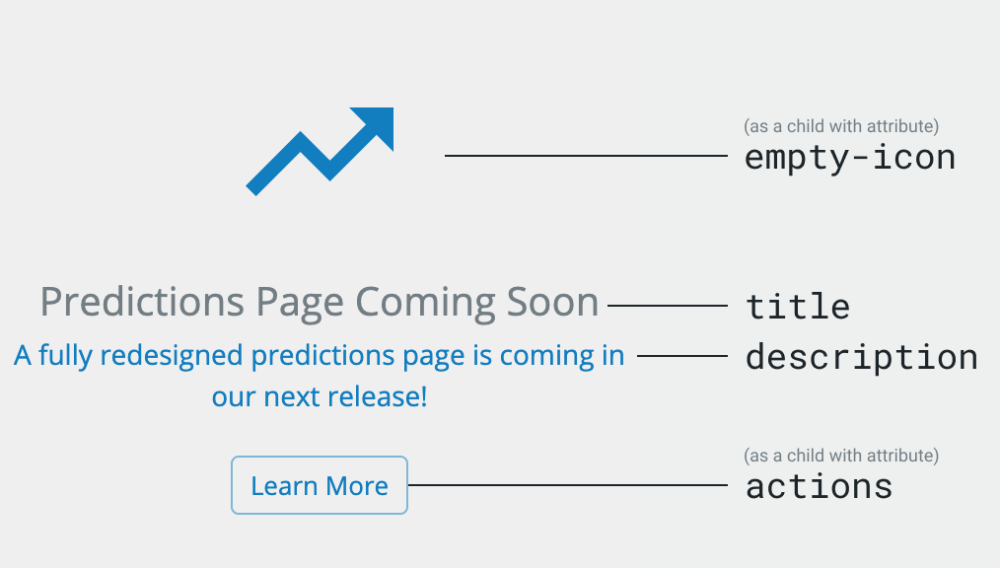

# Empty State

The `<blui-empty-state>` component is an element that can be used as a placeholder when no data is present (such as an empty list, or a placeholder page for future content). This is only used when no data is available, rather than during loading (see [empty states pattern](https://brightlayer-ui.github.io/patterns/empty-states)).

<div style="width: 100%; text-align: center">
    
</div>

The `<blui-empty-state>` component can display a particular icon, text, and actions. Icon components are passed as a child element with the `emptyIcon` attribute - these will typically be a Material icon, Brightlayer UI icon, or Progress Icon. It will also accept Text/Emoji values inside of a `<span>` element.

The `<blui-empty-state>` component can also display additional action elements below the text. These components are passed as a child element with the `actions` attribute - these will typically be a button or group of buttons.

## Usage

<div style="width: 100%; text-align: center">
    
</div>

```typescript
// app.module.ts
import { EmptyStateModule } from '@brightlayer-ui/angular-components';
...
imports: [
    EmptyStateModule
],
```

## API

Parent element (`<blui-empty-state>`) attributes:

<div style="overflow: auto;">

| @Input      | Description                                   | Type     | Required | Default |
| ----------- | --------------------------------------------- | -------- | -------- | ------- |
| description | The secondary text to display (second line)   | `string` | no       |         |
| title       | The primary text to display (first line)      | `string` | no       |         |

</div>

The following child elements are projected into `<blui-empty-state>`:

<div style="overflow: auto;">

| Selector          | Description                    | Required | Default |
| ----------------- | ------------------------------ | -------- | ------- |
| [blui-actions]     | action elements below the text | no       |         |
| [blui-empty-icon]  | The large icon to display      | yes      |         |
| [blui-description] | The secondary text to display  | no       |         |
| [blui-title]       | The main text to display       | no       |         |

</div>

### Classes

Each Brightlayer UI component has classes which can be used to override component styles:

| Name                                       | Description                                  |
|--------------------------------------------|----------------------------------------------|
| blui-empty-state                           | Styles applied to the tag                    |
| blui-empty-state-content                   | Styles applied to the root element           |
| blui-empty-state-empty-icon-wrapper        | Styles applied to the icon container         |
| blui-empty-state-title                     | Styles applied to the title @Input           |
| blui-empty-state-description               | Styles applied to the description @Input     |
| blui-empty-state-actions-wrapper           | Styles applied to the actions container      |
| blui-empty-state-actions-wrapper-no-action | Styles applied to an empty actions container | 
